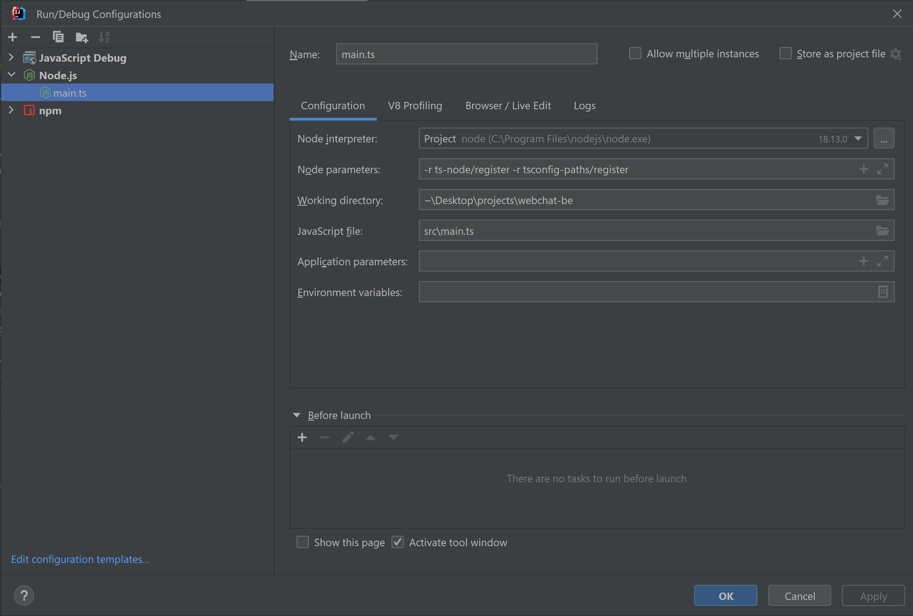
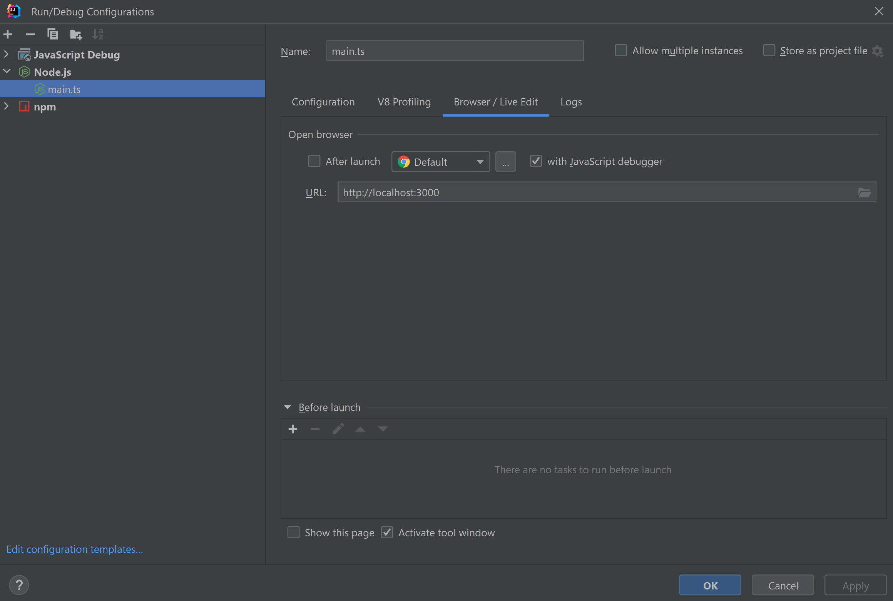

# Database

### Run
```bash
docker-compose up
```

### Run migration and seeding
```bash
yarn run build #generate dist 
yarn run typeorm migration:run -- -d "src/db/db-source.ts"
```
### Revert specific migration
```bash
yarn run typeorm migration:revert -n 1696410272382-initial.ts
```
### Create migration from entities
If entity is changed, apply changes in new migration 
```bash
yarn run build #generate dist 
yarn run typeorm migration:generate -d "src/db/db-source.ts" "src/db/migrations/init"
```

# Application
- Install packages

```bash
yarn install
```

- setup `.env` file from `.env_example`
- run application
  - on development mode
    ```bash
    yarn run start dev
    ```
  - om production mode
    ```bash
    yarn run build
    yarn run start:prod
    ```

# Swagger
http://localhost:3000/api/docs

# Debug
### Add following configuration


